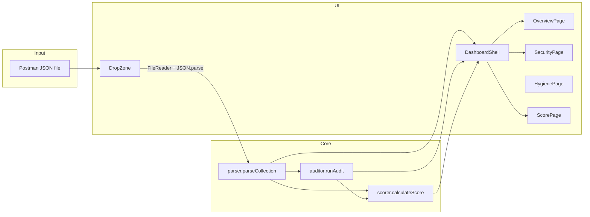

# PostScope: Internal Architecture

This document describes how the PostScope application is structured, how data flows through it, and how to extend it safely.

---

## 1. High-level overview

### What the app does

PostScope is a **single-page React application** that runs entirely in the browser. Users upload a **Postman Collection v2.x JSON** export. The app:

1. **Parses** the file into a normalized in-memory model (`ParsedCollection`).
2. **Audits** that model with deterministic rules and produces a list of **findings** (security, variables, auth, hygiene).
3. **Scores** the collection from those findings and presents **Overview**, **Security**, **Hygiene**, and **Score** views.

No network calls are required for core functionality; collection data is not sent to a backend.

### Core business logic

| Concern | Module | Responsibility |
|--------|--------|----------------|
| Parse Postman JSON → domain model | `src/lib/parser.ts` | Walk `item[]` tree, flatten requests, aggregate methods/auth/variables/folders |
| Rule engine | `src/lib/auditor.ts` | Critical / warning / info checks; each rule emits `Finding` objects |
| Scoring | `src/lib/scorer.ts` | Penalties per severity; overall grade + per-category scores |
| Per-request rollups | `src/lib/requestFindings.ts` | Map findings to requests by name; optional per-request health score |

The **UI layer** (`App.tsx`, pages, components) is largely presentational: it renders parsed data and findings passed as props.

---

## 2. Architecture

### 2.1 Frontend structure

| Layer | Location | Role |
|-------|----------|------|
| Bootstrap | `src/main.tsx` | `createRoot`, global styles, `TooltipProvider` |
| App shell / orchestration | `src/App.tsx` | File ingest, parse/audit/score pipeline, “which page” selection |
| Pages | `src/pages/*.tsx` | Full-width views: Overview, Requests, Security, Hygiene, Repair, Score |
| Feature components | `src/components/*.tsx` | Drop zone, request tree, modals, badges, charts |
| Layout | `src/components/layout/` | `DashboardShell`, `AppSidebar`, `AppHeader` |
| Design system | `src/components/ui/` | Radix-based primitives (buttons, dialogs, tables, …) |
| Domain types | `src/types/postman.ts` | TypeScript shapes for raw Postman JSON |

**Routing:** Dashboard navigation is an in-memory **string union** `NavId`, held by the app shell and toggled from the sidebar. Security-impact findings and hygiene findings are split into separate pages, but scoring and repair still receive the full finding list.

### 2.2 Backend

**None.** The product is a static client bundle (Vite + React). File reading uses `FileReader` in the browser.

### 2.3 Data flow

1. **Landing:** `App` renders `DropZone` until `parsed` is non-null.
2. **Import:** User drops/selects `.json` → `handleFile` reads text → `JSON.parse` → `parseCollection` → `runAudit` → `setParsed` / `setFindings`.
3. **Dashboard:** `calculateScore(parsed, findings)` is derived on each render (cheap; memoization optional).
4. **Child views** receive `parsed`, `findings`, `score` (where needed), and `search` from `App`.

`search` lives in `App` and is wired through `AppHeader` and into `OverviewPage` / `SecurityPage` for consistent filtering.

---

## 3. Key features

### 3.1 Collection import (drop zone)

| | Purpose | How it works | Main files |
|---|--------|--------------|------------|
| Import | Accept Postman export | Drag-and-drop or file input; validates extension; `FileReader.readAsText` → parse | `DropZone.tsx`, `App.tsx` |

Errors surface via `alert` on parse failure; consider replacing with in-app toast/dialog for production polish.

### 3.2 Overview

| | Purpose | How it works | Main files |
|---|--------|--------------|------------|
| Overview | Inventory + visuals | Stat cards; Recharts bar/pie for methods and auth; collapsible **request tree** with global search | `OverviewPage.tsx`, `StatCard.tsx`, `RequestTree.tsx`, `RequestAnalysisModal.tsx` |

The tree builds a folder hierarchy from `ParsedRequest.folderPath`, filters by search, and opens `RequestAnalysisModal` for drill-down.

### 3.3 Security findings

| | Purpose | How it works | Main files |
|---|--------|--------------|------------|
| Security | Review security-impact audit results | Local state for severity/category filters + dialog detail; excludes `hygiene`; merges header `search` with `findingMatchesQuery` | `SecurityPage.tsx`, `SeverityBadge.tsx` |
| Hygiene | Review maintainability notes | Local state for severity filter + dialog detail; shows only `hygiene` findings such as missing descriptions | `HygienePage.tsx`, `SeverityBadge.tsx` |

Brief skeleton flash on mount (`useEffect` timeout) for perceived loading polish.

### 3.4 Score

| | Purpose | How it works | Main files |
|---|--------|--------------|------------|
| Score | Executive posture | `ScoreGauge`, category progress bars, tabbed or static advice derived from finding categories | `ScorePage.tsx`, `ScoreGauge.tsx`, `scorer.ts` |

### 3.5 Request-level analysis modal

| | Purpose | How it works | Main files |
|---|--------|--------------|------------|
| Drill-down | Tie findings to one request | `findingsForRequest` filters by stable `request.id`; labels via `findingDisplay.ts`; `requestHealthScore` applies same penalty table as global scorer (duplicated constants) | `RequestAnalysisModal.tsx`, `requestFindings.ts` |

---

## 4. Component structure

### 4.1 Reusable / feature components

- **`DropZone`:** Landing card; drag state; delegates file to `onFile`.
- **`RequestTree`:** Folder tree + rows; search filter; integrates modal.
- **`RequestAnalysisModal`:** Radix `Dialog` showing request metadata and related findings.
- **`StatCard`:** Metric tiles on overview.
- **`ScoreGauge`:** Visual total score.
- **`MethodBadge` / `SeverityBadge`:** Consistent method and severity chips.
- **`ChartTooltipFrame`:** Shared tooltip wrapper for Recharts.

### 4.2 Layout system

- **`DashboardShell`:** Owns **sidebar collapse** local state (`collapsed`), computes width, positions fixed sidebar + header + padded `main`.
- **`AppSidebar`:** Nav buttons; exports `NavId`; shows separate count badges for Security, Hygiene, and Repair.
- **`AppHeader`:** Global search, collection name display, “analyze another” and decorative controls.

Layout uses **fixed** sidebar/header with `padding-left` / `left` offset derived from collapse width. No CSS-grid app shell abstraction yet.

### 4.3 Patterns

- **Composition:** Pages receive data via props; no page-level data fetching.
- **Hooks:** `useState`, `useCallback`, `useMemo`, `useEffect` used locally; no custom global hooks.
- **Services:** Pure functions in `src/lib/`. Easy to unit test; no DI container.
- **UI library:** “shadcn-style”: copy-paste Radix wrappers in `ui/` with Tailwind + `cva` variants.
- **Aliasing:** `@/` → `src/` (Vite `resolve.alias`).

---

## 5. State management

| State | Owner | Notes |
|-------|--------|------|
| `parsed: ParsedCollection \| null` | `App` | Null ⇒ landing; non-null ⇒ dashboard |
| `findings: Finding[]` | `App` | Produced when file loads; cleared on “analyze another” |
| `active: NavId` | `App` | Which main page is visible |
| `search: string` | `App` | Shared header search |
| `landingLoading: boolean` | `App` | Drop zone loading indicator |
| Sidebar `collapsed` | `DashboardShell` | Pure UI preference |
| Security filters, detail dialog | `SecurityPage` | Local only |
| Hygiene filters, detail dialog | `HygienePage` | Local only |

**No React Context** for domain data. **`TooltipProvider`** wraps the app in `main.tsx` for Radix tooltips.

Derived data:

- `score = calculateScore(parsed, findings)` computed in `App` when dashboard is shown.

---

## 6. API / integrations

| Kind | Detail |
|------|--------|
| External HTTP APIs | **None** in application logic |
| Browser APIs | `FileReader`, `JSON.parse` |
| Third-party scripts | Google Fonts (Elms Sans) linked from `index.css` |
| npm libraries | React, Vite, Radix, Recharts, Lucide, Tailwind utilities |

There is **no** `fetch`, GraphQL, or WebSocket layer today.

---

## 7. Design decisions

1. **Client-only processing:** Keeps deployment simple (static hosting), avoids privacy concerns for secrets in collections, and removes backend operational cost. Trade-off: large collections only scale to browser memory/CPU limits.

2. **Pure-function pipeline (parse → audit → score):** Predictable, test-friendly, and easy to reason about. Trade-off: no incremental parsing or Web Worker offload for huge files.

3. **Findings keyed by stable request `id`:** Parser assigns folder-path ids and disambiguates duplicate names in the same folder (`#2`, `#3`, …). `findingDisplay.ts` maps ids to human-readable paths in the UI.

4. **In-memory navigation instead of URL routes:** Few views; state resets on full reload. Trade-off: cannot deep-link to `/security`; refresh loses import (could add session storage or query params later).

5. **Rule-based auditor vs. ML:** Deterministic rules give explainable results for compliance-minded users. Trade-off: false positives/negatives depend on rule quality only.

6. **Severity penalties duplicated:** `scorer.ts` and `requestFindings.ts` both encode penalty weights; they can drift if only one is updated.

---

## 8. Known limitations

- **Heuristic rules** can produce false positives/negatives; treat output as guidance, not proof.
- **Audit coverage** is heuristic (regex, JSON body shape); non-JSON bodies and edge-case Postman features may be missed.
- **`BASIC_AUTH_PLAINTEXT`** fires when Postman basic auth uses literal `username` / `password` fields (not `{{variables}}`).
- **No persistence:** Refresh clears session; no export of reports.
- **`alert` for errors** on failed parse: rough UX.
- **Large files** may block the main thread during parse/audit.
- **Scoring model** is linear penalty sum; caps at 0–100; may not match every team’s risk model.

---

## 9. How to extend the app

### 9.1 Add a new audit rule

1. Open `src/lib/auditor.ts`.
2. Add checks in `runCriticalChecks`, `runWarningChecks`, or `runInfoChecks` as appropriate.
3. Push a `Finding` with stable *meaning* for `category` and `severity`.
4. If scoring should change, adjust `SEVERITY_PENALTY` in `src/lib/scorer.ts` and keep `requestFindings.ts` **in sync** (or extract shared constants).

### 9.2 Add a new top-level page

1. Extend `NavId` in `app-sidebar.tsx` and add a nav item.
2. Create `src/pages/NewPage.tsx`.
3. In `App.tsx`, render `NewPage` when `active === '…'` and pass required props (`parsed`, `findings`, `score`, `search`).

### 9.3 Add dashboard widgets

- Prefer `OverviewPage.tsx` or `ScorePage.tsx` for analytics widgets.
- Reuse `src/components/ui/card.tsx` and existing chart patterns from `OverviewPage`.

### 9.4 Add backend or sync (future)

Introduce a thin `src/services/` layer with `fetch` wrappers; keep `parser` / `auditor` usable on both client and server if you later move analysis to Node. They are already framework-agnostic TypeScript.

### 9.5 Add routing

Integrate React Router (or similar) in `main.tsx` / `App.tsx`. Persist `parsed`/`findings` in `sessionStorage` or pass file hash if deep-linking matters.

---

## Document maintenance

Update this file when:

- Adding or removing **major modules** under `src/lib/`.
- Changing **navigation** or **global state** ownership.
- Introducing **network** behavior or **build/deploy** assumptions.

Last aligned with repository layout and behavior as of the documented source tree (`App.tsx`, `parser.ts`, `auditor.ts`, `scorer.ts`, layout and pages).
